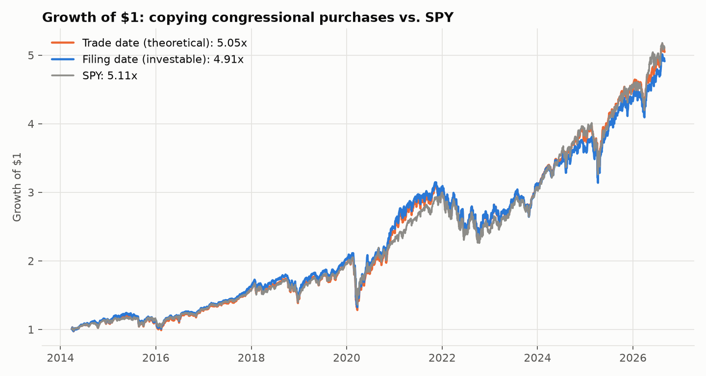
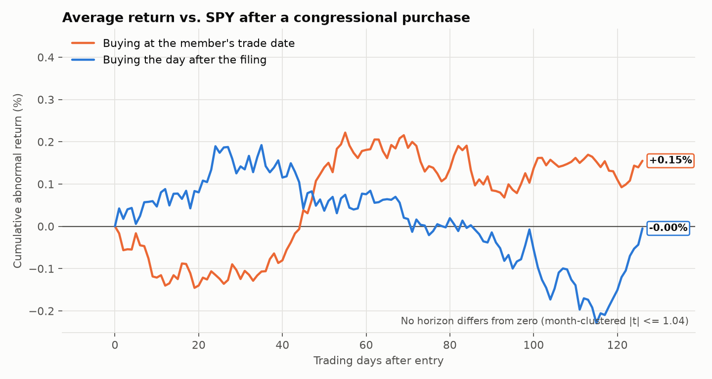
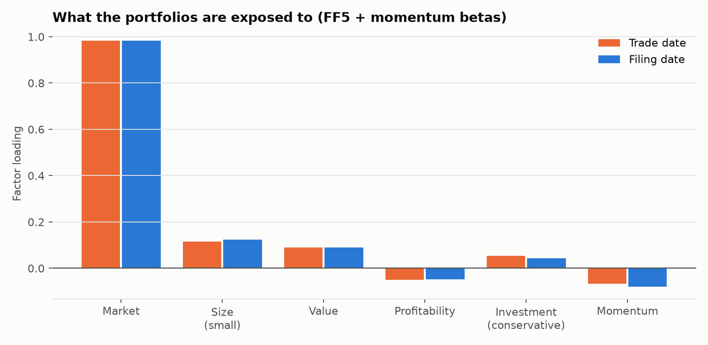
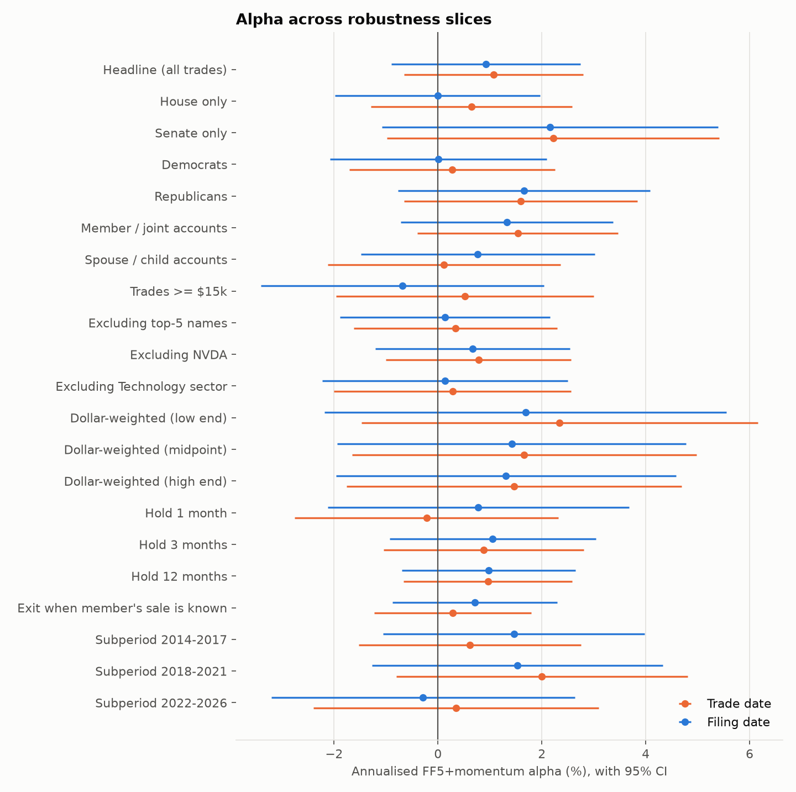

# Can you profit by copying Congress's stock trades?

**Live tracker: [congress-trades-roan.vercel.app](https://congress-trades-roan.vercel.app)**, with every
member's record vs. the market, their trades, and the full study.

**Short answer: no.** Members of Congress must disclose their stock trades within
45 days. This repo builds the full dataset from the official House and Senate
filings: **43,525 common-stock trades by 289 members, 2014–2026**. It then tests
whether copying those trades beats the market.

| Portfolio (Mar 2014 – Aug 2026) | Ann. return | Sharpe | Max DD | FF5+Mom alpha | t-stat |
|---|---|---|---|---|---|
| Buy on the **trade date** (theoretical: what members earned) | 13.9% | 0.70 | −37.4% | +1.1%/yr | 1.22 |
| Buy the day after the **filing** (investable: what you could earn) | 13.7% | 0.69 | −37.3% | +0.9%/yr | 0.99 |
| SPY | 14.1% | 0.74 | −33.7% | — | — |

1. **Do congressional trades beat the market on the trade date?** No. Members'
   purchases earn a factor-adjusted alpha of +1.1%/yr (t = 1.2), which is
   indistinguishable from zero. After six months, the average purchase is
   −0.06% against SPY (t = −0.2).
2. **Does the edge survive the disclosure delay?** There is no edge to lose. The
   trade-date minus filing-date return spread has an alpha of +0.15%/yr
   (t = 0.44, 95% CI −0.5% to +0.8%).
3. **Real alpha, or factor exposure?** The portfolios hold ~340 names and track
   the market (beta 0.98, R² 0.97), with mild small-cap and value tilts. The
   small positive point estimate comes from mega-cap tech. Drop the top five
   names (NVDA, AAPL, MSFT, AMZN, META) and alpha falls from 0.9% to 0.1%/yr.

The investable 95% confidence interval is **−0.9% to +2.7% per year**: any
copy-trading edge, before trading costs, is at most a few percent and plausibly
zero. **0 of 40** robustness slices (chamber, party, account owner, trade size,
weighting, holding period, subperiod, concentration) are significant at 5%, even
before multiple-testing correction.

The two-page write-up is in [reports/memo.md](reports/memo.md).






## Method

**Data.** Every Periodic Transaction Report (PTR) from 2014 to Sep 2026:
- **Senate:** scraped from the Senate eFD search, where electronic filings are HTML tables.
- **House:** parsed from the House Clerk's PDFs. Older House PDFs garble letter
  case ("aXP", "[sT]"), wrap amounts across lines, and only carry asset-type tags
  from about 2019. The parser handles all of these, with tests.
- **Prices:** daily total-return prices from yfinance.
- **Factors:** daily Fama-French 5 factors plus momentum from the Ken French Data Library.
- **Party:** from [unitedstates/congress-legislators](https://github.com/unitedstates/congress-legislators),
  matched to the term active on the trade date.

**Cleaning.** Each step is counted in
[`data/processed/cleaning_waterfall.csv`](data/processed/cleaning_waterfall.csv):

| Step | Rows left |
|---|---|
| Raw transaction rows | 72,060 |
| Drop exchanges; options, bonds, funds, other non-stock; no ticker | 54,935 |
| Drop impossible dates (filed before trade, or more than 3 years late) | 54,548 |
| Drop duplicate rows from amended filings (keep the earliest disclosure) | 50,508 |
| Drop tickers with no yfinance price (delisted → survivorship) | 44,863 |
| Drop ETFs/funds (yfinance instrument type), no price on trade date, recycled tickers | **43,525** |

**Portfolios.** Calendar-time portfolios. Each disclosed purchase opens a position.
- **Hold:** 126 trading days (~6 months).
- **Weighting:** equal-weighted across open positions, rebalanced daily.
- **Trade-date portfolio:** enters at the close of the transaction date.
- **Filing-date portfolio:** enters at the close of the trading day *after* the
  filing date. Filings can be posted after the close, so entering on the filing
  date itself would be look-ahead.
- **Window:** starts once both portfolios hold at least 20 names (28 Mar 2014) and
  ends when the factor data ends (31 Aug 2026).

**Inference.**
- **Factor regressions:** daily excess returns on CAPM, FF3, FF5 and FF5+Mom,
  with Newey-West (10-lag) standard errors.
- **Event study:** returns over SPY. Events in the same month share market
  shocks, so t-stats treat each calendar month as one observation.
- **Robustness:** Holm-adjusted p-values across all 20 slices per portfolio.

## Pitfalls, and how they're handled

| Pitfall | Treatment |
|---|---|
| **Look-ahead bias** | The investable portfolio uses only the filing date, entering the day after. A disclosed *sale* closes a position only after that sale's filing date. Both are enforced by unit tests (`test_filing_date_portfolio_has_no_lookahead`, `test_exit_on_sale_uses_only_known_information`). |
| **Survivorship bias** | 5,645 cleaned trades (11.2%) have no yfinance history, mostly acquired companies (Twitter, Activision, Celgene, Allergan, Red Hat) and rolled-up MLPs. 28 ticker changes with continuous history (e.g. SQ→XYZ, UTX→RTX, MMC→MRSH) were mapped by hand. Acquisition targets often rise on announcement, so the missing trades probably bias results slightly *against* the copier. |
| **Noisy amounts** | Amounts are disclosed as ranges. Dollar-weighted portfolios using the low end, midpoint and high end give alphas of 1.7%, 1.4% and 1.3% (all t < 0.9). |
| **Multiple testing** | 40 slice tests. At a 5% level, two false positives would be expected by chance; none occur. Holm adjustment is reported anyway. |
| **Coverage** | Scanned paper filings (26% of House PTRs and 17% of Senate PTRs, concentrated in early years) are image-only and excluded. |
| **Recycled tickers** | Each filed asset name is compared with the priced company's name. 355 mismatches are dropped. |

## Validation

- **Automated cross-check.** For 2014–2020 Senate stock trades, the independent
  [Senate Stock Watcher](https://github.com/timothycarambat/senate-stock-watcher-data)
  dataset was compared with this repo's parse:
  - 97.8% of its trades appear here.
  - 89.2% of this repo's trades appear there. The gap is mostly early-2014 filings
    that predate eFD's asset-type column, which that dataset leaves untyped.
  - Mismatches are listed in `data/processed/crosscheck_only_*.csv`.
- **Manual spot-check.** [`data/processed/spot_check_50.csv`](data/processed/spot_check_50.csv)
  is a stratified sample of 50 trades (25 House, 25 Senate, every year), each
  linked to its original filing, for line-by-line verification.

## Reproduce

```bash
python -m venv .venv && .venv/Scripts/activate      # or source .venv/bin/activate
pip install -e . pandas numpy statsmodels yfinance matplotlib pytest requests beautifulsoup4 lxml pdfplumber pyarrow
python -m congress.pipeline        # scrape + clean + price + study + figures (≈2h first run, cached after)
pytest
```

Raw filings and price caches (`data/raw`, `data/interim`) are git-ignored and
re-downloadable. The cleaned trades and every results table are committed.

## Website

`web/` is a Vue 3 + Vite site built on [frappe-ui](https://github.com/frappe/frappe-ui), the component
library behind [Frappe Builder](https://github.com/frappe/builder). It is fully static, reading JSON exported
by `python -m congress.site_data`, and is hosted on Vercel.

```bash
python -m congress.site_data          # refresh web/public/data/ from the study outputs
cd web && npm install && npm run dev  # local preview
npx vercel deploy --prod              # from web/
```

## Layout

```
src/congress/
  scrape_senate.py   Senate eFD search + HTML PTR parser
  scrape_house.py    House Clerk index + PDF PTR parser
  clean.py           stock filter, amounts, dates, party match, amendment de-dup
  prices.py          yfinance prices, ticker-rename map, rate-limit handling
  dataset.py         price-side filters (delisted, ETFs, recycled tickers)
  factors.py         Ken French daily FF5 + momentum
  portfolio.py       calendar-time portfolio engine (trade-date / filing-date rules)
  metrics.py         return, Sharpe, drawdown, tracking error, IR
  analysis.py        factor regressions, event study, concentration, Holm
  study.py           runs everything -> reports/results/
  plots.py           figures -> reports/figures/
  validate.py        Senate cross-check, 50-trade spot-check sample
  site_data.py       per-member stats + JSON export for the website
tests/               parser, portfolio-timing and statistics tests
```
